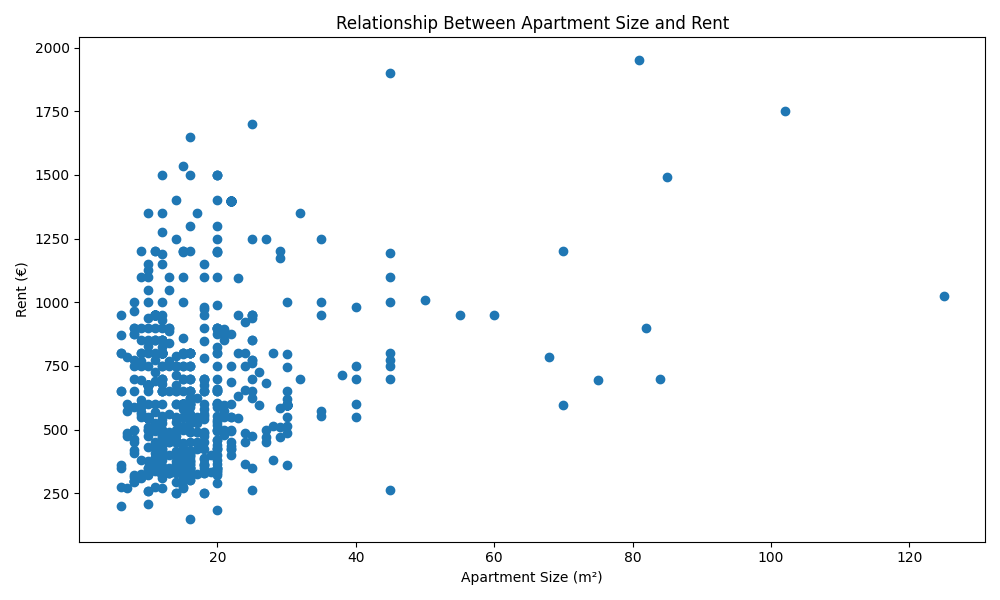

# Netherlands Housing Analysis

Data analysis project focused on rental housing prices in the Netherlands using Python, pandas, and matplotlib.

---

## Project Overview

This project analyzes Dutch rental housing listings to understand rental affordability patterns across different cities in the Netherlands.

The main goal of the analysis is not only to compare average rent prices, but also to understand how rental prices change when apartment size is considered.

The project focuses on three main questions:

- Which Dutch cities have the highest average rent?
- Which cities are the most expensive by price per square meter?
- What is the relationship between apartment size and rental price?

---

## Technologies Used

- Python
- pandas
- matplotlib
- VS Code
- GitHub

---

## Dataset

The dataset was obtained from Kaggle and contains Dutch rental housing listings.

The dataset includes information such as:

- City
- Rent price
- Property size in square meters
- Furnishing type
- Property type
- Date of advertisement

---

## Data Cleaning

Before analysis, the dataset required cleaning and formatting.

The following steps were performed:

- Removed an unnecessary index column
- Cleaned rent values by removing extra text symbols
- Converted rent values from text format into numeric format
- Cleaned apartment size values by removing `"m2"`
- Converted apartment size into numeric format
- Filtered cities with very few listings to reduce unreliable averages

Example cleaning step:

```python
df["Rent"] = df["Rent"].str.replace(",-", "", regex=False)
df["Rent"] = pd.to_numeric(df["Rent"])
```

---

## Feature Engineering

A new metric was created to make the analysis more meaningful:

```python
Price_per_m2 = Rent / Meters
```

This metric helps compare rental prices more fairly, because total rent alone does not show whether a property is expensive for its size.

For example, a €900 apartment of 15 m² is much less affordable than a €900 apartment of 40 m².

---

## Analysis Performed

The analysis includes:

- Average rent by city
- Price per square meter by city
- Filtering cities based on listing count
- Relationship between apartment size and rent
- Visual comparison of rental affordability patterns

---

## Key Insights

### 1. Amsterdam is expensive, but not always the absolute leader

Amsterdam appears among the most expensive cities by average rent. However, the analysis shows that some smaller cities may have higher average rent in this dataset.

This does not necessarily mean that those cities are more expensive overall. It may be influenced by a smaller number of listings or a few high-priced properties.

---

### 2. Price per square meter gives a more realistic view

Average rent alone can be misleading because it does not consider apartment size.

After calculating price per square meter, the ranking changes. This shows that some cities may look affordable by total rent, but are actually expensive when property size is considered.

---

### 3. Tilburg shows a high price per square meter

In the filtered dataset, Tilburg showed one of the highest average prices per square meter.

This suggests that rental units in Tilburg may be relatively expensive for their size, even if the total rent is not always the highest.

---

### 4. Apartment size and rent have a positive relationship

The scatter plot shows that larger apartments generally tend to have higher rental prices.

However, the relationship is not perfectly proportional. Some small apartments still have high rents, while some larger apartments appear more affordable compared to their size.

---

### 5. Most listings are small rental units

Many listings are concentrated around smaller apartment sizes, especially between approximately 10–25 m².

This may reflect the presence of student housing, rooms, and small studio apartments in the rental market.

---

### 6. Outliers exist in the rental market

The dataset contains several outliers where some medium or large apartments have unusually high rental prices.

These outliers may be caused by location, furnishing quality, property type, or premium housing segments.

---

## Charts

### Average Rent by City

This chart compares the top cities by average rental price after filtering cities with very few listings.


---

### Price per Square Meter by City

This chart compares cities based on average price per square meter. This provides a better affordability comparison than average rent alone.


---

### Relationship Between Apartment Size and Rent

This scatter plot shows the relationship between apartment size and rental price.



---

## Conclusion

This project shows that rental affordability cannot be judged only by total rent. A more useful approach is to compare rent together with apartment size.

The analysis shows that Amsterdam remains one of the expensive rental markets, but price per square meter reveals additional affordability differences between cities.

The project also highlights the importance of data cleaning, feature engineering, and careful interpretation of results when working with real-world housing data.

---

## Author

Arsen Indzheian