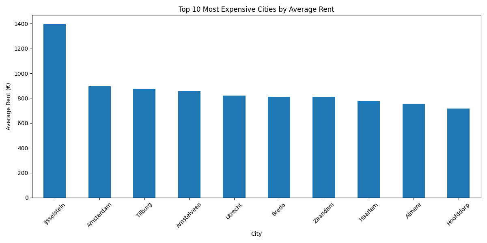
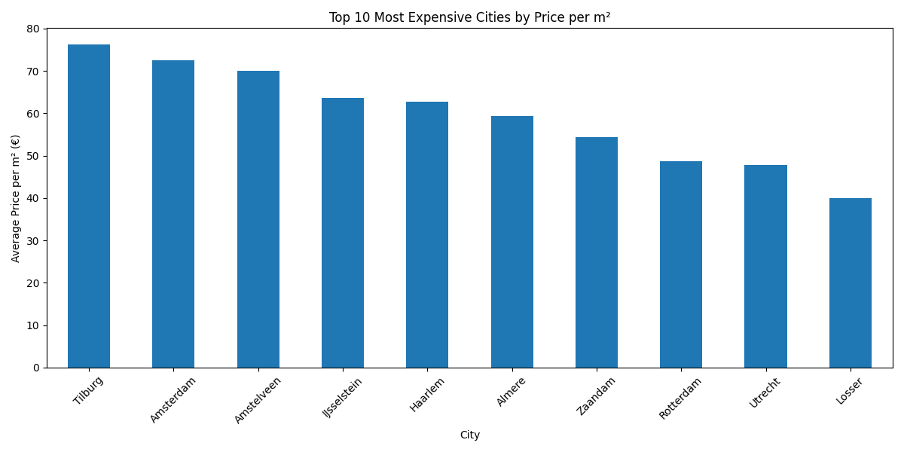

# Netherlands Housing Analysis

Data analysis project focused on rental housing prices in the Netherlands using Python, pandas, and matplotlib.

---

## Project Overview

This project analyzes Dutch rental housing listings to identify:

- Most expensive cities by average rent
- Most expensive cities by price per square meter
- Rental market differences between Dutch cities
- Housing affordability patterns

The analysis includes:
- Data cleaning
- Feature engineering
- Grouped statistical analysis
- Data visualization

---

## Technologies Used

- Python
- pandas
- matplotlib
- VS Code
- GitHub

---

## Dataset

The dataset contains Dutch rental housing listings with information such as:

- City
- Rent price
- Property size (m²)
- Furnishing type
- Property type

---

## Key Features

### Data Cleaning
- Removed unnecessary columns
- Converted rent values to numeric format
- Cleaned apartment size data

### Feature Engineering

Created a custom metric:

```python
Price_per_m2 = Rent / Meters

## Charts

### Average Rent by City



---

### Price per Square Meter by City

